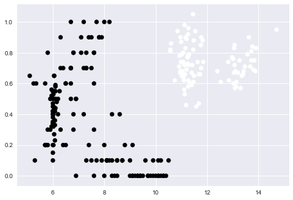
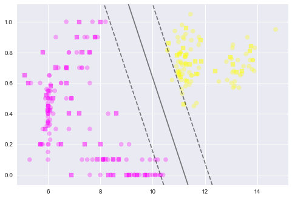
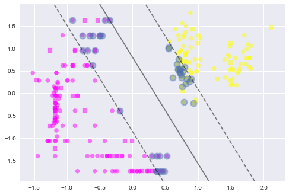

## Contents
{:.no_toc}
*  
{: toc}


```python
#!pip install seaborn
%matplotlib inline
import numpy as np
import matplotlib.pyplot as plt
import pandas as pd
import seaborn as sns
pd.set_option('display.width', 500)
pd.set_option('display.max_columns', 100)
```


```python
df = pd.read_csv("local-olives-cleaned.csv")
df.head()
```


<div>
<style>
    .dataframe thead tr:only-child th {
        text-align: right;
    }

    .dataframe thead th {
        text-align: left;
    }

    .dataframe tbody tr th {
        vertical-align: top;
    }
</style>
<table border="1" class="dataframe">
  <thead>
    <tr style="text-align: right;">
      <th></th>
      <th>areastring</th>
      <th>region</th>
      <th>area</th>
      <th>palmitic</th>
      <th>palmitoleic</th>
      <th>stearic</th>
      <th>oleic</th>
      <th>linoleic</th>
      <th>linolenic</th>
      <th>arachidic</th>
      <th>eicosenoic</th>
      <th>regionstring</th>
    </tr>
  </thead>
  <tbody>
    <tr>
      <th>0</th>
      <td>North-Apulia</td>
      <td>1</td>
      <td>1</td>
      <td>10.75</td>
      <td>0.75</td>
      <td>2.26</td>
      <td>78.23</td>
      <td>6.72</td>
      <td>0.36</td>
      <td>0.60</td>
      <td>0.29</td>
      <td>South</td>
    </tr>
    <tr>
      <th>1</th>
      <td>North-Apulia</td>
      <td>1</td>
      <td>1</td>
      <td>10.88</td>
      <td>0.73</td>
      <td>2.24</td>
      <td>77.09</td>
      <td>7.81</td>
      <td>0.31</td>
      <td>0.61</td>
      <td>0.29</td>
      <td>South</td>
    </tr>
    <tr>
      <th>2</th>
      <td>North-Apulia</td>
      <td>1</td>
      <td>1</td>
      <td>9.11</td>
      <td>0.54</td>
      <td>2.46</td>
      <td>81.13</td>
      <td>5.49</td>
      <td>0.31</td>
      <td>0.63</td>
      <td>0.29</td>
      <td>South</td>
    </tr>
    <tr>
      <th>3</th>
      <td>North-Apulia</td>
      <td>1</td>
      <td>1</td>
      <td>9.66</td>
      <td>0.57</td>
      <td>2.40</td>
      <td>79.52</td>
      <td>6.19</td>
      <td>0.50</td>
      <td>0.78</td>
      <td>0.35</td>
      <td>South</td>
    </tr>
    <tr>
      <th>4</th>
      <td>North-Apulia</td>
      <td>1</td>
      <td>1</td>
      <td>10.51</td>
      <td>0.67</td>
      <td>2.59</td>
      <td>77.71</td>
      <td>6.72</td>
      <td>0.50</td>
      <td>0.80</td>
      <td>0.46</td>
      <td>South</td>
    </tr>
  </tbody>
</table>
</div>


```python
acidlist=['palmitic', 'palmitoleic', 'stearic', 'oleic', 'linoleic', 'linolenic', 'arachidic', 'eicosenoic']
```


```python
dfsouth=df[df.regionstring=='South']
dfsouth.head()
```


<div>
<style>
    .dataframe thead tr:only-child th {
        text-align: right;
    }

    .dataframe thead th {
        text-align: left;
    }

    .dataframe tbody tr th {
        vertical-align: top;
    }
</style>
<table border="1" class="dataframe">
  <thead>
    <tr style="text-align: right;">
      <th></th>
      <th>areastring</th>
      <th>region</th>
      <th>area</th>
      <th>palmitic</th>
      <th>palmitoleic</th>
      <th>stearic</th>
      <th>oleic</th>
      <th>linoleic</th>
      <th>linolenic</th>
      <th>arachidic</th>
      <th>eicosenoic</th>
      <th>regionstring</th>
    </tr>
  </thead>
  <tbody>
    <tr>
      <th>0</th>
      <td>North-Apulia</td>
      <td>1</td>
      <td>1</td>
      <td>10.75</td>
      <td>0.75</td>
      <td>2.26</td>
      <td>78.23</td>
      <td>6.72</td>
      <td>0.36</td>
      <td>0.60</td>
      <td>0.29</td>
      <td>South</td>
    </tr>
    <tr>
      <th>1</th>
      <td>North-Apulia</td>
      <td>1</td>
      <td>1</td>
      <td>10.88</td>
      <td>0.73</td>
      <td>2.24</td>
      <td>77.09</td>
      <td>7.81</td>
      <td>0.31</td>
      <td>0.61</td>
      <td>0.29</td>
      <td>South</td>
    </tr>
    <tr>
      <th>2</th>
      <td>North-Apulia</td>
      <td>1</td>
      <td>1</td>
      <td>9.11</td>
      <td>0.54</td>
      <td>2.46</td>
      <td>81.13</td>
      <td>5.49</td>
      <td>0.31</td>
      <td>0.63</td>
      <td>0.29</td>
      <td>South</td>
    </tr>
    <tr>
      <th>3</th>
      <td>North-Apulia</td>
      <td>1</td>
      <td>1</td>
      <td>9.66</td>
      <td>0.57</td>
      <td>2.40</td>
      <td>79.52</td>
      <td>6.19</td>
      <td>0.50</td>
      <td>0.78</td>
      <td>0.35</td>
      <td>South</td>
    </tr>
    <tr>
      <th>4</th>
      <td>North-Apulia</td>
      <td>1</td>
      <td>1</td>
      <td>10.51</td>
      <td>0.67</td>
      <td>2.59</td>
      <td>77.71</td>
      <td>6.72</td>
      <td>0.50</td>
      <td>0.80</td>
      <td>0.46</td>
      <td>South</td>
    </tr>
  </tbody>
</table>
</div>


## Predicting via SVM


```python
dfnew=df[['eicosenoic', 'region', 'regionstring']]
dfnew['linoarch']=(0.969/1022.0)*df.linoleic + (0.245/105.0)*df.arachidic
dfnew.head()
```


<div style="max-height:1000px;max-width:1500px;overflow:auto;">
<table border="1" class="dataframe">
  <thead>
    <tr style="text-align: right;">
      <th></th>
      <th>eicosenoic</th>
      <th>region</th>
      <th>regionstring</th>
      <th>linoarch</th>
    </tr>
  </thead>
  <tbody>
    <tr>
      <th>0</th>
      <td> 0.29</td>
      <td> 1</td>
      <td> South</td>
      <td> 0.007772</td>
    </tr>
    <tr>
      <th>1</th>
      <td> 0.29</td>
      <td> 1</td>
      <td> South</td>
      <td> 0.008828</td>
    </tr>
    <tr>
      <th>2</th>
      <td> 0.29</td>
      <td> 1</td>
      <td> South</td>
      <td> 0.006675</td>
    </tr>
    <tr>
      <th>3</th>
      <td> 0.35</td>
      <td> 1</td>
      <td> South</td>
      <td> 0.007689</td>
    </tr>
    <tr>
      <th>4</th>
      <td> 0.46</td>
      <td> 1</td>
      <td> South</td>
      <td> 0.008238</td>
    </tr>
  </tbody>
</table>
</div>


```python
dfnosouth=df[df.regionstring!='South']
dfnosouth.head()
```


<div>
<style>
    .dataframe thead tr:only-child th {
        text-align: right;
    }

    .dataframe thead th {
        text-align: left;
    }

    .dataframe tbody tr th {
        vertical-align: top;
    }
</style>
<table border="1" class="dataframe">
  <thead>
    <tr style="text-align: right;">
      <th></th>
      <th>areastring</th>
      <th>region</th>
      <th>area</th>
      <th>palmitic</th>
      <th>palmitoleic</th>
      <th>stearic</th>
      <th>oleic</th>
      <th>linoleic</th>
      <th>linolenic</th>
      <th>arachidic</th>
      <th>eicosenoic</th>
      <th>regionstring</th>
    </tr>
  </thead>
  <tbody>
    <tr>
      <th>323</th>
      <td>Inland-Sardinia</td>
      <td>2</td>
      <td>5</td>
      <td>11.29</td>
      <td>1.20</td>
      <td>2.22</td>
      <td>72.72</td>
      <td>11.12</td>
      <td>0.43</td>
      <td>0.98</td>
      <td>0.02</td>
      <td>Sardinia</td>
    </tr>
    <tr>
      <th>324</th>
      <td>Inland-Sardinia</td>
      <td>2</td>
      <td>5</td>
      <td>10.42</td>
      <td>1.35</td>
      <td>2.10</td>
      <td>73.76</td>
      <td>11.16</td>
      <td>0.35</td>
      <td>0.90</td>
      <td>0.03</td>
      <td>Sardinia</td>
    </tr>
    <tr>
      <th>325</th>
      <td>Inland-Sardinia</td>
      <td>2</td>
      <td>5</td>
      <td>11.03</td>
      <td>0.96</td>
      <td>2.10</td>
      <td>73.80</td>
      <td>10.85</td>
      <td>0.32</td>
      <td>0.94</td>
      <td>0.03</td>
      <td>Sardinia</td>
    </tr>
    <tr>
      <th>326</th>
      <td>Inland-Sardinia</td>
      <td>2</td>
      <td>5</td>
      <td>11.18</td>
      <td>0.97</td>
      <td>2.21</td>
      <td>72.79</td>
      <td>11.54</td>
      <td>0.35</td>
      <td>0.94</td>
      <td>0.02</td>
      <td>Sardinia</td>
    </tr>
    <tr>
      <th>327</th>
      <td>Inland-Sardinia</td>
      <td>2</td>
      <td>5</td>
      <td>10.52</td>
      <td>0.95</td>
      <td>2.15</td>
      <td>73.88</td>
      <td>11.26</td>
      <td>0.31</td>
      <td>0.92</td>
      <td>0.01</td>
      <td>Sardinia</td>
    </tr>
  </tbody>
</table>
</div>


```python
plt.scatter(dfnosouth.linoleic, dfnosouth.arachidic, c=dfnosouth.region, s=50);
```





```python
from sklearn.cross_validation import train_test_split
from sklearn.metrics import confusion_matrix
from sklearn.svm import SVC # "Support Vector Classifier"

def plot_svc_decision_function(clf, ax=None):
    """Plot the decision function for a 2D SVC"""
    if ax is None:
        ax = plt.gca()
    x = np.linspace(plt.xlim()[0], plt.xlim()[1], 30)
    y = np.linspace(plt.ylim()[0], plt.ylim()[1], 30)
    Y, X = np.meshgrid(y, x)
    P = np.zeros_like(X)
    for i, xi in enumerate(x):
        for j, yj in enumerate(y):
            P[i, j] = clf.decision_function([[xi, yj]])
    return ax.contour(X, Y, P, colors='k',
                      levels=[-1, 0, 1], alpha=0.5,
                      linestyles=['--', '-', '--'])

```


```python
X = dfnosouth[['linoleic', 'arachidic']]
y = (dfnosouth.regionstring.values=='Sardinia')*1
Xtrain, Xtest, ytrain, ytest = train_test_split(X.values ,y)
clf = SVC(kernel="linear")
clf.fit(Xtrain, ytrain)
plt.scatter(Xtrain[:, 0], Xtrain[:, 1], c=ytrain, s=50, cmap='spring', alpha=0.3)
plot_svc_decision_function(clf, plt.gca())
plt.scatter(clf.support_vectors_[:, 0], clf.support_vectors_[:, 1],
                s=200, facecolors='none')
plt.scatter(Xtest[:, 0], Xtest[:, 1], c=ytest, s=50, marker="s", cmap='spring', alpha=0.5);
```





```python
clf.score(Xtest, ytest)
```


    1.0


```python
confusion_matrix(clf.predict(Xtest), ytest)
```


    array([[31,  0],
           [ 0, 32]])


## Allowing for crossovers


```python
from sklearn.model_selection import GridSearchCV
def cv_optimize_svm(X, y, n_folds=10, num_p=50):
    #clf = SVC()
    #parameters = {"C": np.logspace(-4, 3, num=num_p), "gamma": np.logspace(-4, 3, num=10)}
    clf = SVC(kernel="linear", probability=True)
    parameters = {"C": np.logspace(-4, 3, num=num_p)}
    gs = GridSearchCV(clf, param_grid=parameters, cv=n_folds)
    gs.fit(X, y)
    return gs

def get_optim_classifier_svm(indf, inacidlist, clon, clonval):
    subdf=indf[inacidlist]
    subdfstd=(subdf - subdf.mean())/subdf.std()
    X=subdfstd.values
    y=(indf[clon].values==clonval)*1
    Xtrain, Xtest, ytrain, ytest = train_test_split(X, y, train_size=0.8)
    #Xtrain, Xtest, ytrain, ytest=X,X,y,y
    fitted=cv_optimize_svm(Xtrain, ytrain)
    return fitted, Xtrain, ytrain, Xtest, ytest
```


```python
thesvcfit, Xtr, ytr, Xte, yte = get_optim_classifier_svm(dfnosouth, ['linoleic','arachidic'],'regionstring', "Sardinia")
#thesvcfit, Xtr, ytr, Xte, yte = get_optim_classifier_binary(dfsouthns, ['palmitic','palmitoleic'],'area', 3)
thesvcfit.best_estimator_, thesvcfit.best_params_, thesvcfit.best_score_
```


    (SVC(C=0.071968567300115138, cache_size=200, class_weight=None, coef0=0.0,
       decision_function_shape=None, degree=3, gamma='auto', kernel='linear',
       max_iter=-1, probability=True, random_state=None, shrinking=True,
       tol=0.001, verbose=False), {'C': 0.071968567300115138}, 1.0)


```python
def plot_svm_new(clf,Xtr,ytr,Xte,yte):
    plt.scatter(Xtr[:, 0], Xtr[:, 1], c=ytr, s=50, cmap='spring', alpha=0.5)
    plt.scatter(Xte[:, 0], Xte[:, 1], marker='s', c=yte, s=50, cmap='spring', alpha=0.5)

    #plt.xlim(-1, 4)
    #plt.ylim(-1, 6)
    plot_svc_decision_function(clf, plt.gca())
    plt.scatter(clf.support_vectors_[:, 0], clf.support_vectors_[:, 1],
                s=100, facecolors=None , lw=2, alpha=0.4)
print(dict(kernel="linear",**thesvcfit.best_params_))
clsvc=SVC(**dict(kernel="linear",**thesvcfit.best_params_)).fit(Xtr, ytr)
plot_svm_new(clsvc, Xtr, ytr, Xte, yte)
```


    {'kernel': 'linear', 'C': 0.071968567300115138}





The best fit allows for a bigger margin by allowing some inbetween penalization. If we use the standard C=1 in scikit-learn you see that we are allowing for less penalization.
